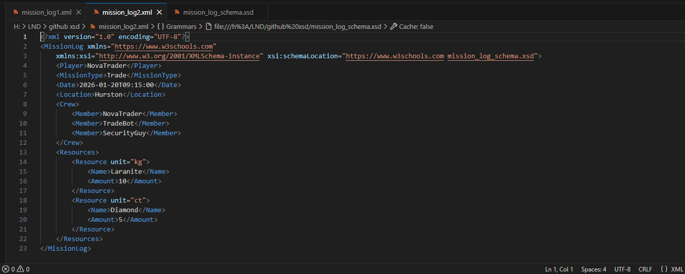
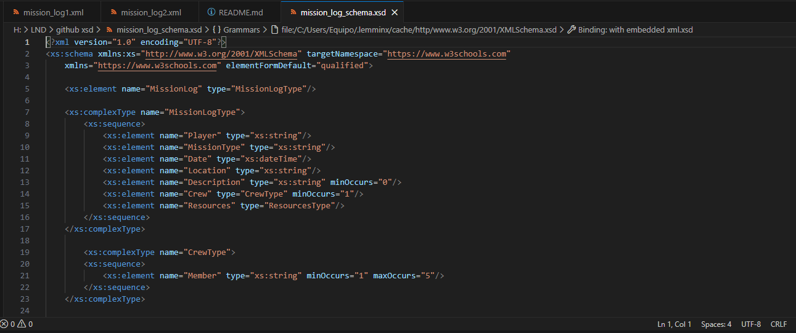

# Star Citizen Mission & Trade Log App

## Description
This mobile application allows Star Citizen players to log their completed missions and trade activities. The app sends mission and trade data to a remote database via an API, enabling players to track their progress and resource management across the universe.

## API Description
The API receives XML-formatted mission logs from the app, validates them against an XML Schema, and stores the data in a remote database. It supports endpoints for submitting new logs and retrieving player history.

## Data Exchanged
The information sent from the app to the API includes:
- Player name
- Mission type (Exploration, Trade, etc.)
- Date and time
- Location (in-game planet or station)
- Description (optional mission details)
- Crew (1-5 members, optional)
- Resources obtained or traded:
	- Name
	- Amount
	- Unit (e.g., kg, ct)

## XML Files
- `mission_log1.xml` and `mission_log2.xml`: Example mission logs now include optional Description, Crew members, and unit attributes for resources.
- `mission_log_schema.xsd`: XML Schema updated to validate new fields and constraints (minOccurs, maxOccurs, attributes).

## Validation Screenshots

## Database Reflection Example
When the XML is processed by the API, the resource data is stored in the database as follows:

| Name      | Amount | Unit |
|-----------|--------|------|
| Diamond   | 5      | ct   |
| Laranite  | 10     | kg   |
| Quantanium| 50     | kg   |
| Gold      | 20     | kg   |

Crew members and description are also stored in their respective tables/fields.

## Tools and Resources Used
- [VS Code](https://code.visualstudio.com/)
- [FREEFORMATTER](https://www.freeformatter.com/xml-validator-xsd.html/)
- [GitHub](https://github.com/)
- [Star Citizen](https://robertsspaceindustries.com/star-citizen)
- [Star Citizen Tools Wiki](https://starcitizen.tools/) - Game data and resources

## General Impression
This project demonstrates the integration of a mobile app with a remote API using XML for data exchange and including schema validation. The documentation and structure follow best practices for clarity and reproducibility.
